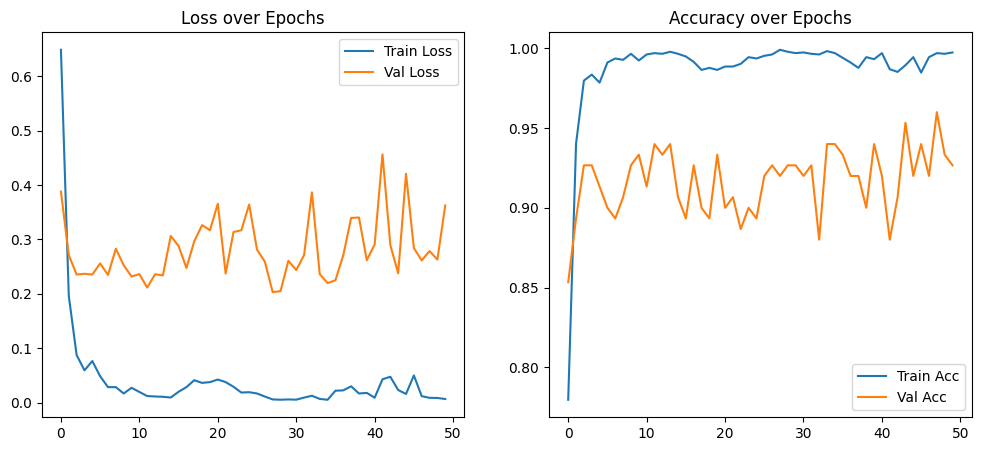
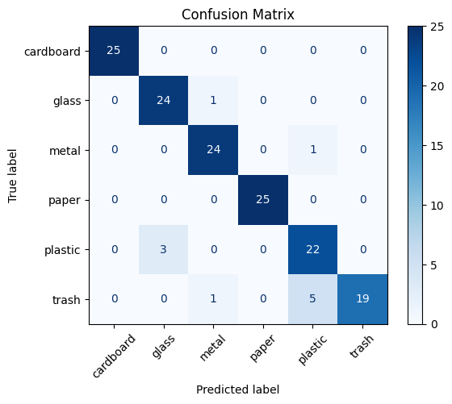
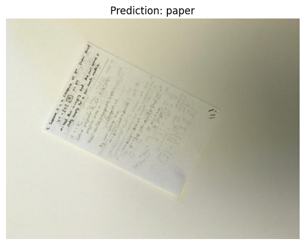

# Image-Classification-PyTorch

This repository contains a Jupyter Notebook that implements an image classification pipeline using PyTorch and pretrained convolutional neural networks. It is designed to train and evaluate a model for classifying images into various categories.

## 📂 Dataset

For demonstration purposes, this project uses the [Garbage Image Dataset](https://www.kaggle.com/datasets/farzadnekouei/trash-type-image-dataset/data) from Kaggle. The dataset consists of labeled images representing different types of waste, such as cardboard, glass, metal, paper, plastic, and trash.

Before training, you need to manually split the dataset into training and validation sets using the following folder structure:

```
my_dataset/
├── train/
│ ├── class1/
│ ├── class2/
│ └── ...
└── val/
├── class1/
├── class2/
└── ...
```
> In this demonstration, the validation set contains **25 images per class**, organized inside the `val/` directory.

## 🧠 Model Architecture

In the provided `.ipynb` notebook, the model used is **ResNet18**, a widely adopted convolutional neural network architecture available via `torchvision.models`. It is initialized with pretrained weights to take advantage of transfer learning, allowing for faster and more effective training on custom datasets.
 
You can easily modify the notebook to use other architectures (e.g., ResNet34, EfficientNet, etc.) by adjusting a few lines of code.

## 📈 Results

### 🔸 Loss and Accuracy Over Epochs


### 🔸 Confusion Matrix 


### 🔸 Inference



